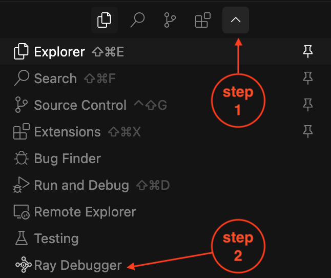
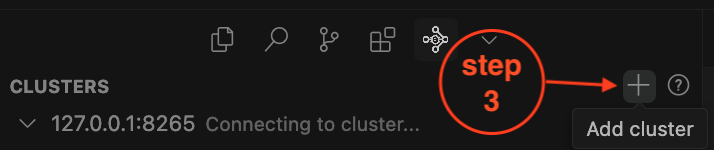
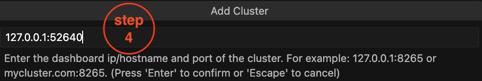
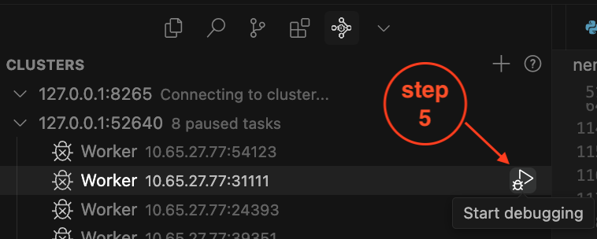

# Debug NeMo RL Applications

This guide explains how to debug NeMo RL applications, covering two scenarios. It first outlines the procedure for debugging distributed Ray worker/actor processes using the Ray Distributed Debugger within a SLURM environment, and then details debugging the main driver script.

## Debug Worker/Actors on SLURM

Since Ray programs can spawn multiple workers and actors, using the Ray Distributed Debugger is essential to accurately jump to breakpoints on each worker.

### Prerequisites

* Install the [Ray Debugger VS Code/Cursor extension](https://docs.ray.io/en/latest/ray-observability/ray-distributed-debugger.html).
* Launch the [interactive cluster](./cluster.md#interactive-launching) with `ray.sub`.
* Launch VS Code/Cursor on the SLURM login node (where `squeue`/`sbatch` is available).
* Add `breakpoint()` in your code under actors & tasks (i.e. classes or functions decorated with `@ray.remote`).
* **Ensure** `RAY_DEBUG=legacy` is not set since this debugging requires the default distributed debugger.

### Forward a Port from the Head Node

From the SLURM login node, query the nodes used by the interactive `ray.sub` job as follows:

```sh
teryk@slurm-login:~$ squeue --me
             JOBID PARTITION        NAME     USER ST       TIME  NODES NODELIST(REASON)
           2504248     batch ray-cluster   terryk  R      15:01      4 node-12,node-[22,30],node-49
```

The first node is always the head node, so we need to port forward the dashboard port to the login node:

```sh
# Traffic from the login node's $LOCAL is forwarded to node-12:$DASHBOARD_PORT
# - If you haven't changed the default DASHBOARD_PORT in ray.sub, it is likely 8265
# - Choose a LOCAL_PORT that isn't taken. If the cluster is multi-tenant, 8265
#   on the login node is likely taken by someone else.
ssh -L $LOCAL_PORT:localhost:$DASHBOARD_PORT -N node-12

# Example chosing a port other than 8265 for the LOCAL_PORT
ssh -L 52640:localhost:8265 -N node-12
```

The example output from the port-forwarding with `ssh` may print logs like this, where the warning is expected.

```text
Warning: Permanently added 'node-12' (ED25519) to the list of known hosts.
bind [::1]:52640: Cannot assign requested address
```

### Open the Ray Debugger Extension

In VS Code or Cursor, open the Ray Debugger extension by clicking the Ray icon in the activity bar or searching for "View: Show Ray Debugger" in the Command Palette (Ctrl+Shift+P or Cmd+Shift+P).



### Add the Ray Cluster

Click on the "Add Cluster" button in the Ray Debugger panel.



Enter the address and port you set up in the port forwarding step. If you followed the example above using port 52640, you would enter:



### Add a Breakpoint and Run Your Program

The Ray Debugger Panel for cluster `127.0.0.1:52640` lists all active breakpoints. To begin debugging, select a breakpoint from the dropdown and click `Start Debugging` to jump to that worker.

Note that you can jump between breakpoints across all workers with this process.



## Debug the Driver Script

By default, setting breakpoints in the driver script (outside of  `@ray.remote`) will not pause program execution when using Ray. To enable pausing at these breakpoints, set the environment variable to `RAY_DEBUG=legacy`:

```sh
RAY_DEBUG=legacy uv run ....
```
