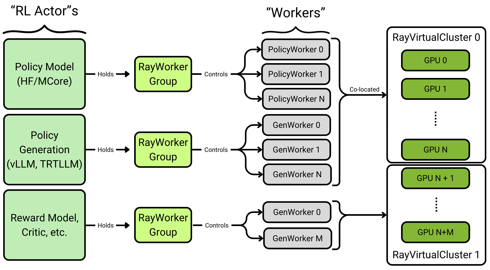

# Design and Philosophy
In this section, we will describe the problems this library aims to solve and motivate/dicuss the NeMo-RL APIs.

## Motivation
Online RL requires coordinating a lot of different pieces of software/models
- Policy Model/Training Framework
- Fast inference Framework (vLLM, SGLANG, TRT-LLM)
- Reward Environments, Critics, etc.

We refer to each of these pieces of software as an **RL Actor**.

Fundamentally, we need to be able to do 4 things between these RL Actors:
- Resource them (provide GPUs/CPUs)
- Isolate them
  - RL Actors may each set global variables or have conflicting dependencies, so they each need to live in an isolated process environment with configurable dependencies
- Coordinate them (control)
- Communicate between them (data)

## Design

We create composable and hackable abstractions for each layer of the tasks above
- Resourcing -> {py:class}`RayVirtualCluster <nemo_rl.distributed.virtual_cluster.RayVirtualCluster>`
- Isolation -> {py:class}`RayWorkerGroup <nemo_rl.distributed.worker_groups.RayWorkerGroup>`
- Coordination -> A Single-Process Controller using Ray
- Communication -> Data flows through one of the following:
  - the single controller 
  - a communication scheme set-up by the controller such as
    - NCCL Collectives
    - Multiprocess Queues

By creating a common interface for these 4 tasks, **RL algorithm code looks the same from 1 GPU to 1000 GPUs and does not care about the implementation of each RL Actor (Megatron, HF, Grad student with pen and paper)**



### {py:class}`RayVirtualCluster <nemo_rl.distributed.virtual_cluster.RayVirtualCluster>`
VirtualCluster provides a basic abstraction on top of Ray Placement Groups that allow you to section off a part of your compute resources for WorkerGroups to run on as though they had their own cluster. They support running just one WorkerGroup on each VirtualCluster, or *colocation*, where multiple WorkerGroups share resources (i.e running policy training(hf) and generation(vllm) on the same GPUs in-turn).

Minimally, it has has the following core API:
```python
class RayVirtualCluster:
"""
    Creates a virtual distributed cluster using Ray placement groups.

    This class simplifies distributed training setup by:
    - Creating placement groups that represent logical compute nodes
    - Allocating GPU and CPU resources for distributed workers
    - Managing communication between distributed processes

    - Bundle: A resource allocation unit (ex: 4 GPUs on a single node)
    - Worker: A process that performs computation (model training/inference)
    - Node: A physical or virtual machine containing multiple bundles
"""
    def __init__(self, bundle_ct_per_node_list: List[int], {other args}):
        """
        Initialize a virtual cluster using Ray placement groups.

        Args:
            bundle_ct_per_node_list: List specifying GPU bundles per node
                                    (e.g., [2,2] creates 2 nodes with 2 GPU bundles each)
        """
    def get_placement_groups(self):
        """
        Returns a list of placement groups that have at least one bundle, filtering out empty nodes.
        This represents the "virtual cluster" - only nodes that are actually being used.

        Returns:
            List of placement groups that have at least one bundle
        """
```

### {py:class}`RayWorkerGroup <nemo_rl.distributed.worker_groups.RayWorkerGroup>`
All work is done by "Worker Processes"(Ray Actors) that run on a small unit of resources (usually 1 CPU or 1 CPU+GPU). These workers are managed by *RayWorkerGroup*
```python
class RayWorkerGroup:
    """
    Manages a group of distributed Ray worker/actor processes that execute tasks in parallel.

    This class creates and manages Ray actor instances that run on resources
    allocated by a RayVirtualCluster. It handles:
    - Worker creation and placement on specific GPU resources
    - Setting up distributed training environment variables (rank, world size, etc.)
    - Executing methods across all workers in parallel
    - Collecting and aggregating results
    - Support for tied worker groups where multiple workers process the same data
    """
```
`RayWorkerGroup` provides functions like `run_all_workers_single_data` and `run_all_workers_multiple_data` to control and communicate to individual worker processes.


### Single-Controller & Execution Diagram
We control the RL Actors using a single-process head controller. Using the aforementioned abstractions, this allows us to represent the main loop of GRPO as though we were working on 1 GPU
```python
# data processing/transformations between each step omitted
def grpo_train(
    policy: PolicyInterface,
    policy_generation: GenerationInterface,
    environment: EnvironmentInterface,
    dataloader: Iterable[BatchedDataDict[DatumSpec]],
):
    loss_fn = GRPOLossFn()
    for batch in dataloader:
        batch.repeat_interleave(num_generations_per_prompt) # repeat for GRPO
        generations = policy_generation.generate(batch) 
        rewards = environment.step(generations)

        logprobs = policy.get_logprobs(generations)
        reference_logprobs = policy.get_reference_logprobs(generations)

        training_data = calculate_grpo_trainnig_data(generations, logprobs, reference_logprobs, rewards)
        policy.train(generations, logprobs, reference_logprobs, GRPOLossFn)
```
For a real implementation of grpo (with valiation, checkpointing, memory movement, and the omitted data processing steps), see [grpo_train](../../nemo_rl/algorithms/grpo.py)
