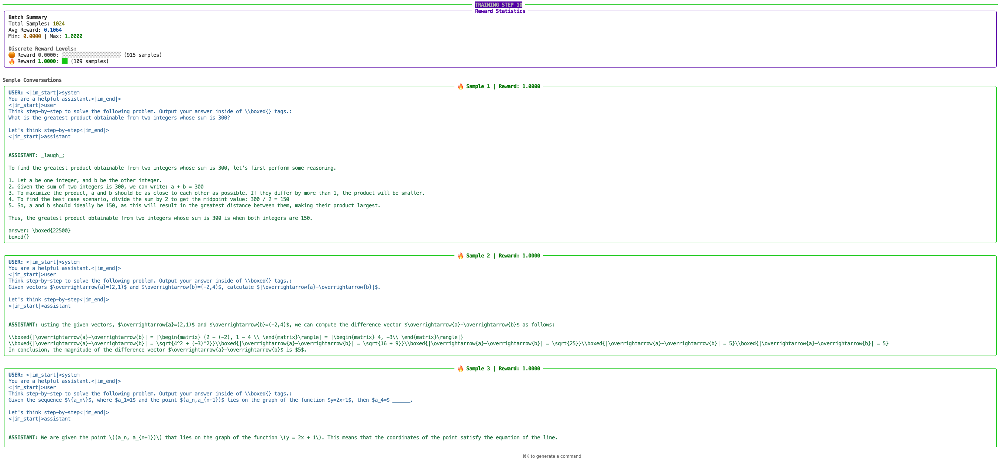

# Logger

## Requirements:

* Tracking distributed metrics with specified reductions (mean, max, etc)
* Tracking distributed timing with (usually) 'max' reduction across ranks
* Logging:
   * WandB
   * Tensorboard

## Overall Design

Since there is a single controller, the single process running the main training loop will gather the metrics and do the logging.

To handle multiple logger backends, we will have a {py:class}`LoggerInterface <nemo_reinforcer.utils.logger.LoggerInterface>` interface that the {py:class}`TensorboardLogger <nemo_reinforcer.utils.logger.TensorboardLogger>` and {py:class}`WandbLogger <nemo_reinforcer.utils.logger.WandbLogger>` will implement:

```python
class LoggerInterface(ABC):
    """Abstract base class for logger backends."""

    @abstractmethod
    def log_metrics(self, metrics: Dict[str, Any], step: int, prefix: Optional[str]: "") -> None:
        """Log a dictionary of metrics."""
        pass

    @abstractmethod
    def log_hyperparams(self, params: dict[str, Any]) -> None:
        """Log dictionary of hyperparameters."""
        pass
```

A {py:class}`Logger <nemo_reinforcer.utils.logger.Logger>` wrapper class will also implement {py:class}`LoggerInterface <nemo_reinforcer.utils.logger.LoggerInterface>` and will contain a list of loggers it delegates to when writing logs. This will be the main class the user uses in the training loop. Usage example:

```python
# Initialize logger with both wandb and tensorboard enabled
logging_config = {
    "wandb_enabled": True,
    "tensorboard_enabled": False,

    "wandb": {
        "project": "grpo-dev",
        "name": "grpo-dev-logging",
    },
    "tensorboard": {
        "log_dir": "logs",
    },
}
logger = Logger(
    cfg=logger_config,
)

# Log metrics, will go to both wandb and tensorboard
logger.log_metrics({
    "loss": 0.123,
}, step=10)
```

## Validation Pretty Logging

The logger supports pretty-formatted logging of validation samples to help visualize model outputs during training. This feature is controlled by the `num_val_samples_to_print` configuration parameter:

```python
logger:
  wandb_enabled: false
  tensorboard_enabled: false
  num_val_samples_to_print: 10
```

When `num_val_samples_to_print` is set to a value greater than 0, the logger will generate well-formatted text outputs for the specified number of validation samples. This is particularly useful for:

1. Quickly inspecting model generation quality during training
2. Comparing inputs and outputs side-by-side
3. Tracking validation sample performance over time

### Example Output

When enabled, the pretty logging will generate formatted text similar to:



