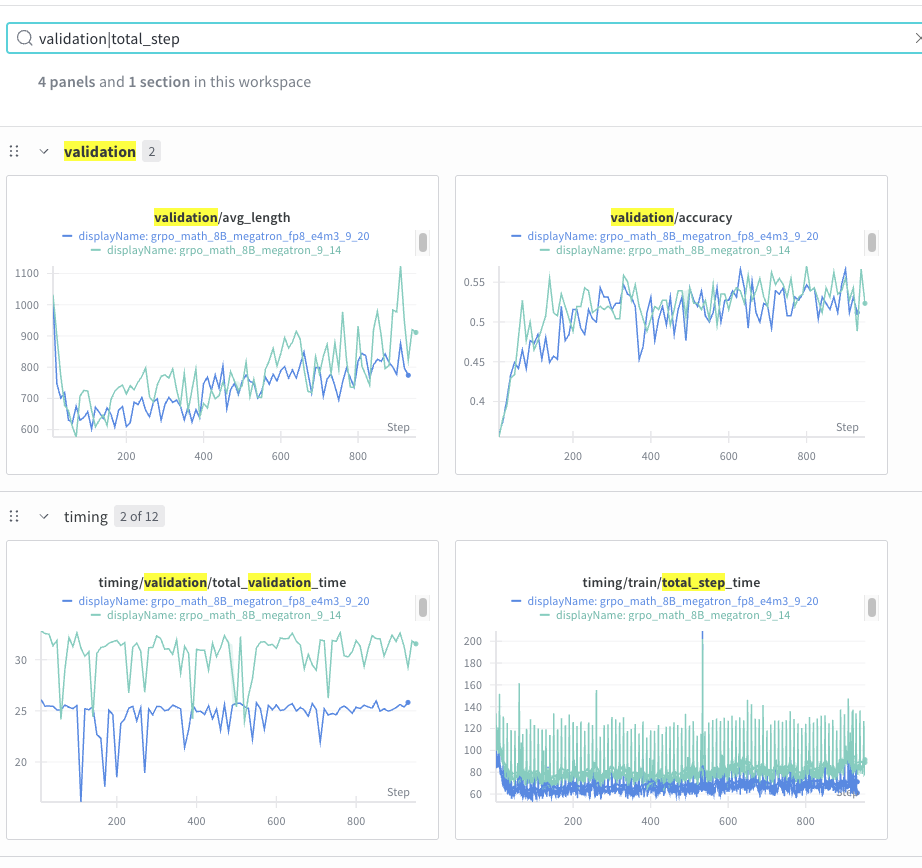

# FP8 Quantization in NeMo RL

This module provides a suite of tools to enable FP8 quantization for large language models. It is currently under active development.

## Supported Features

### FP8 Generation
- Implements **Deepseek-style FP8** quantization using **sub-channel scaling**.

### FP8 Training
- Uses **TransformerEngine** for linear layer implementation.
- Supports both **Deepseek-style sub-channel scaling** and **per-tensor scaling**.

## Integration with NeMo RL

NeMo RL applies monkey patches to several core `vLLM` components to enable FP8 generation for reinforcement learning.  
When the `init_fp8` function is called, it modifies the following:

### RayDistributedExecutor
- For multi-GPU inference, the executor is patched to ensure that every worker process applies the same FP8 patches **before model initialization**.

### Quantization Utilities
- Functions within `vllm.model_executor.layers.quantization` are replaced with custom implementations that support:
  - **Power-of-2 scaling**
  - Other custom features

### Weight Loading
- A custom `load_weights` function performs on-the-fly quantization of model weights from higher-precision formats to FP8.


## Usage

FP8 generations are recommended to be configured with the following settings:

   ```
    loss_fn:
        # importance sampling helps improve stability
        use_importance_sampling_correction: true

    policy:
        generation:
            vllm_cfg:
                precision: 'fp8'
                # DeepGemm is much more performant than vLLM's default cutlass fp8 subchannel scaling kernels
                use_deep_gemm: true
                # Users can specify number of layers to be kept in BF16 precision in their experiments
                # and by default they are set to 0
                num_last_layers_in_bf16: 0
                num_first_layers_in_bf16: 0
                # Use FP32 scaling factors. Rounding scaling factors to the nearest pow2 may improve quantization 
                # fidelity however this feature is still under research.
                use_weight_pow2_scale: False
                use_activation_pow2_scale: False
```

"To train with FP8, you need to set the Megatron path and configure it using the following settings:

```
    policy:
        megatron_cfg:
            fp8_cfg:
                fp8: "hybrid"               # choices: [hybrid, e4m3]
                fp8_recipe: "tensorwise"    # choices: [tensorwise, blockwise]
                fp8_param: false            # boolean value
```

## Compatibility Note for Deepseek-Style FP8 Training

When using FP8 training with Deepseek-style FP8 (sub-channel scaling), be aware of the following compatibility issue:

The TransformerEngine implementation for this recipe requires **cuBLAS version ≥ 12.9**. However, `nemo-rl` currently depends on **Torch 2.7.1**, which in turn requires **CUDA 12.8**. As a result, attempting to use the default setup will trigger the following error:

```
File "/opt/ray_venvs/nemo_rl.models.policy.megatron_policy_worker.MegatronPolicyWorker/lib/python3.12/site-packages/transformer_engine/pytorch/fp8.py", line 646, in fp8_autocast
FP8GlobalStateManager.fp8_autocast_enter(
File "/opt/ray_venvs/nemo_rl.models.policy.megatron_policy_worker.MegatronPolicyWorker/lib/python3.12/site-packages/transformer_engine/pytorch/fp8.py", line 465, in fp8_autocast_enter
assert fp8_block_available, reason_for_no_fp8_block
           ^^^^^^^^^^^^^^^^^^^
AssertionError: FP8 block scaled GEMM requires Hopper and CUDA >= 12.9.
```
This issue will be resolved once the Torch version is upgraded to **≥ 2.8.0** (Please follow [#1122](https://github.com/NVIDIA-NeMo/RL/issues/1122) for more progress on the upgrade). In the meantime, you can enable Deepseek-style FP8 training using the following workaround:

- **Build the NGC PyTorch container** from `docker/Dockerfile.ngc_pytorch`.  
  This setup uses the system Python environment, which includes **CUDA version 12.9 or higher**, meeting the requirements for TransformerEngine’s FP8 implementation.


## Accuracy



The above results are from Llama-3.1-8B-Instruct GRPO experiments. You can run them with the following example configs:
* For BF16: `examples/configs/grpo_math_8B_megatron.yaml`
* For FP8: `examples/configs/grpo_math_8B_megatron_fp8.yaml`

In the experiment in this figure, enabling FP8 rollout and training gives 15%-25% decrease in step time, and the validation accuracy curves match up to 1000 step.
Efforts are ongoing to performs longer runs and further optimize performance.
