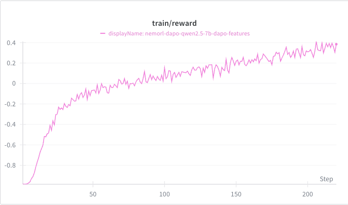
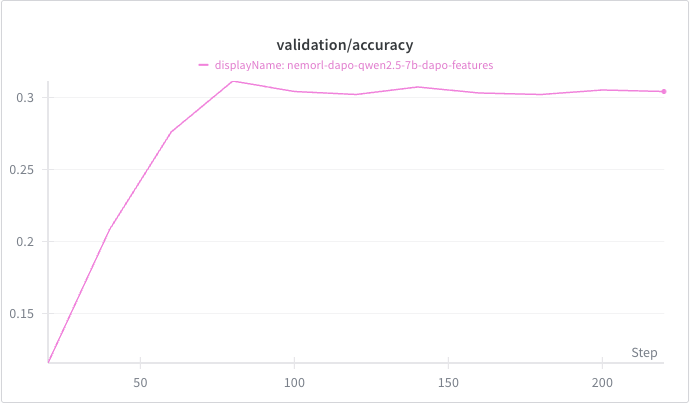

# An in-depth Walkthrough of DAPO in NeMo RL

This guide covers the [Decoupled Clip and Dynamic Sampling Policy Optimization (DAPO)](https://arxiv.org/pdf/2503.14476) implementation in NeMo RL.

DAPO introduces four key improvements over Group Relative Policy Optimization (GRPO):
1. **Clip-Higher**, which promotes the diversity of the system and avoids entropy collapse
2. **Dynamic Sampling**, which improves training efficiency and stability
3. **Token-Level Policy Gradient Loss**, which is critical in long-CoT RL scenarios
4. **Overlong Reward Shaping**, which reduces reward noise and stabilizes training

This document focuses on DAPO-specific features: Dynamic Sampling and Overlong Reward Shaping. For foundational concepts on GRPO including data handling, policy training, generation, and loss functions, see the [NeMo RL GRPO Guide](grpo.md).


## Quickstart: Launch a DAPO Run

To get started quickly, use the example configuration [examples/configs/recipes/llm/dapo-qwen2.5-7b.yaml](../../examples/configs/recipes/llm/dapo-qwen2.5-7b.yaml). You can launch this using the same script as GRPO:

```bash
uv run examples/run_grpo_math.py --config examples/configs/recipes/llm/dapo-qwen2.5-7b.yaml {overrides}
```

**Reminder**: Don't forget to set your HF_HOME, WANDB_API_KEY, and HF_DATASETS_CACHE (if needed). You'll need to do a `huggingface-cli login` as well for LLaMA models.

## Dynamic Sampling

Standard GRPO trains on all generated responses, even when they have identical rewards (zero gradient signal) within a prompt group of generations. Dynamic sampling filters to keep only groups with diverse rewards (`std > 0`), and accumulates them across batches until reaching the target batch size. Dynamic sampling can be enabled by setting `use_dynamic_sampling=True` in your configuration. For implementation details, see the [`dynamic_sampling`](../../nemo_rl/algorithms/grpo.py) function. 

**Algorithm**: For each training step:

1. Sample `batch_multiplier × num_prompts_per_step` prompts from the dataset. The default value of `batch_multiplier` is 1.
2. Generate `num_generations_per_prompt` responses per prompt and compute rewards.
3. Compute the baseline and standard deviation for each prompt group.
4. Filter prompt groups where `std > 0`.
5. Store these prompts in a cache until reaching the target training batch size of `num_prompts_per_step × num_generations_per_prompt` samples.
6. Samples are accumulated until the maximum number of allowed batches (`dynamic_sampling_max_gen_batches`) is reached. If the cache still does not meet the target rollout batch size at that point, an error is raised. To resolve this, consider adjusting parameters such as `num_prompts_per_step` or `num_generations_per_prompt` to increase sample diversity, or revisit the complexity of your data.
7. Perform training on the collected samples with nonzero standard deviation

### About batch_multiplier

`batch_multiplier` (a float ≥ 1.0) controls the initial prompt pool size by sampling `batch_multiplier × num_prompts_per_step` prompts before dynamic sampling. Higher values increase memory and compute requirements, while very low values (e.g., 1.0) may slow the cache accumulation of prompt groups with nonzero standard deviation. The optimal value depends on the dataset, model capacity, and overall training setup.  When **dynamic sampling** is enabled, we also log two additional metrics:

 * `dynamic_sampling_num_gen_batches`: The number of generation rounds required to produce `num_prompts_per_step * num_generations_per_prompt` samples with a nonzero standard deviation. If this number remains consistently high across iterations, try increasing the `batch_multiplier`. The maximum allowed value for this parameter is determined by `dynamic_sampling_max_gen_batches`.
 * `dynamic_sampling_num_discarded_valid_samples`: The number of samples with a nonzero standard deviation that are discarded because the total exceeds `num_prompts_per_step * num_generations_per_prompt`. If this value is frequently high (e.g., above `0.5 * num_prompts_per_step * num_generations_per_prompt`) and `dynamic_sampling_num_gen_batches` is consistently 1, it suggests that a large fraction of the dataset is being discarded unnecessarily. To improve data efficiency, consider decreasing the `batch_multiplier`.

## Reward Shaping
DAPO introduces an overlong reward shaping mechanism to reduce reward noise and stabilize training. This approach penalizes responses that exceed a specified length threshold, helping to prevent the model from generating excessively long outputs while maintaining solution quality.

For a detailed explanation of the overlong reward shaping mechanism, please refer to Section 3.4 of the [DAPO paper](https://arxiv.org/pdf/2503.14476). For implementation details, see the [`apply_reward_shaping`](../../nemo_rl/algorithms/reward_functions.py) function.

## Configuration

```yaml
grpo:
  use_dynamic_sampling: true  # Enable DAPO dynamic sampling
  num_prompts_per_step: 512   # Target number of prompts per training step
  num_generations_per_prompt: 16  # Generations per prompt
  batch_multiplier: 3    # Dataloader batch size = batch_multiplier × num_prompts_per_step
  dynamic_sampling_max_gen_batches: 10     # Maximum number of batches to be used for accumulating non-zero std prompts
  reward_scaling:
    enabled: true
    source_min: 0.0
    source_max: 1.0
    target_min: -1.0
    target_max: 1.0
  
  reward_shaping:
    enabled: true
    overlong_buffer_length: 4096     # Threshold before penalties apply (paper uses 4096)
    overlong_buffer_penalty: 1.0     # Penalty per excess token
    max_response_length: 20480       # Hard maximum generation length
```

**Key Parameters:**
- **`use_dynamic_sampling`**: When enabled, activates DAPO's dynamic sampling algorithm to filter and accumulate prompt groups with nonzero standard deviation
- **`batch_multiplier`**: Factor that scales the initial prompt pool size for sampling.
- **`dynamic_sampling_max_gen_batches`**: Maximum number of batches to be used for accumulating nonzero standard deviation prompts.
- **`reward_scaling`**: When enabled, clamps each reward in the batch to [source_min, source_max] and linearly rescales it to [target_min, target_max]. Defaults: source_min=0.0, source_max=1.0, target_min=0.0, target_max=1.0.
- **`reward_shaping`**: When enabled, applies the overlong penalty mechanism described in the Reward Shaping section above. Responses exceeding `max_response_length - overlong_buffer_length` receive penalties proportional to their excess length, helping to reduce reward noise and stabilize training.

> [!NOTE]
> When dynamic sampling is enabled, monitor the `filtered_reward` metric to track the average reward of the prompts with std > 0.

> [!NOTE]
> **Clip-Higher** and **Token-Level Policy Gradient Loss** are already supported in NeMo RL and can be configured through the `loss_fn` section of your experiment config:
> - Set `ratio_clip_max` to enable Clip-Higher (e.g., `ratio_clip_max: 0.28`)
> - Set `token_level_loss: true` to enable Token-Level Policy Gradient Loss
> 
> See the full [DAPO example config](../../examples/configs/recipes/llm/dapo-qwen2.5-7b.yaml) for reference.

## Example Training Results
Using the [DAPO example config](../../examples/configs/recipes/llm/dapo-qwen2.5-7b.yaml), you can expect to see intermediate plots such as the training reward curve and validation accuracy on AIME24 for Qwen/Qwen2.5-Math-7B. These plots serve as reference outputs to help verify reproducibility. They are not intended to reflect the best accuracy that can be achieved using DAPO for this model.




## References

- **DAPO Paper**: [Decoupled Clip and Dynamic Sampling Policy Optimization](https://arxiv.org/pdf/2503.14476)
- **GRPO Paper**: [Group Relative Policy Optimization](https://arxiv.org/abs/2402.03300)
- **[NeMo RL GRPO Guide](grpo.md)**