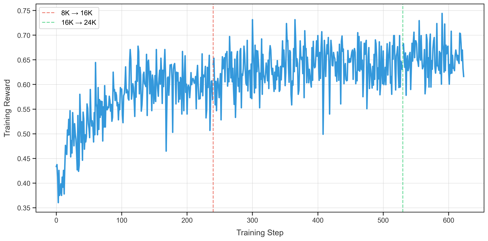
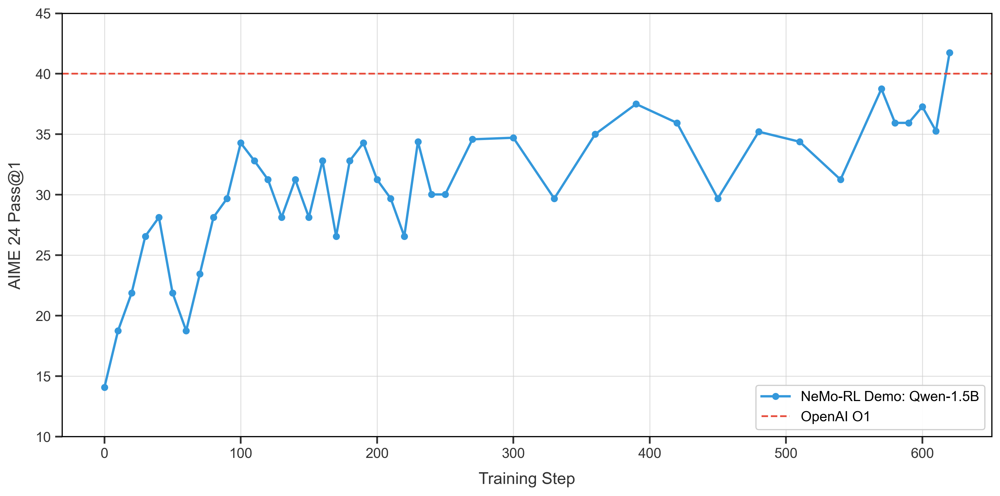

# GRPO on DeepScaler

This guide explains how to use NeMo RL to train long Chain of Thought (CoT) reasoning models with Group Relative Policy Optimization (GRPO). To do so, we train [DeepSeek-R1-Distill-Qwen-1.5B](https://huggingface.co/deepseek-ai/DeepSeek-R1-Distill-Qwen-1.5B) on the [DeepScaleR](https://huggingface.co/datasets/agentica-org/DeepScaleR-Preview-Dataset) dataset. We then show how to use NeMo RL's evaluation scripts to evaluate the trained model on the [AIME24](https://huggingface.co/datasets/HuggingFaceH4/aime_2024) benchmark.


## Train the Model
We follow the DeepScaleR recipe and train the model in three stages. In the first stage, we train with an 8K context window. In the second stage, we train with a 16K context window. In the third stage, we train with a 24K context window.
To train the model using NeMo RL, use the `examples/configs/grpo-deepscaler-1.5b-8K.yaml` config file. This file closely matches the experiment settings in the original DeepScaleR recipe. We then train with `examples/configs/grpo-deepscaler-1.5b-16K.yaml` and `examples/configs/grpo-deepscaler-1.5b-24K.yaml` for the second and third stages, respectively.

```sh
uv run examples/run_grpo_math.py --config=examples/configs/grpo-deepscaler-1.5b-8K.yaml
uv run examples/run_grpo_math.py --config=examples/configs/grpo-deepscaler-1.5b-16K.yaml policy.model_name=/path/to/8K/checkpoint/hf
uv run examples/run_grpo_math.py --config=examples/configs/grpo-deepscaler-1.5b-24K.yaml policy.model_name=/path/to/16K/checkpoint/hf
```

At the end of each stage, you need to specify the Hugging Face checkpoint to continue training with. To get this checkpoint, we convert a model checkpoint to a Hugging Face checkpoint with the following command:

```sh
uv run examples/convert_dcp_to_hf.py --config=results/grpo-deepscaler-1.5b-8K/step_240/config.yaml --dcp-ckpt-path=results/grpo-deepscaler-1.5b-8K/step_240/policy/weights --hf-ckpt-path=results/grpo-deepscaler-1.5b-8K/step_240/hf
```

When running the next command, we use the Hugging Face checkpoint as the initial checkpoint. We train with an 8K context window for 240 steps, a 16K context window for 290 steps, and a 24K context window for 50 steps. We run all experiments on a single 8XH100 80GB node or on a single 8XA100 80GB node.

## Training Curve
When using the above commands, we get the following training curve:



Notably, we are able to achieve an average training reward of 0.65 in just 400 training steps.

## Evaluate the Model
Throughout training, the checkpoints of the model will be saved to the `results` folder (specified by `checkpointing.checkpoint_dir`). To evaluate the model, we first need to convert the PyTorch distributed checkpoint to Hugging Face format as before. Then, to evaluate on the [AIME24 benchmark](https://huggingface.co/datasets/HuggingFaceH4/aime_2024), use the following command:

```sh
uv run examples/run_eval.py \
    generation.model_name=results/grpo-deepscaler-1.5b-8K/step_240/hf
```

Use `generation.model_name` to specify the path to the Hugging Face checkpoint. In addition, we use AIME24 as the validation dataset and calculate pass@1 on it throughout training.

## Evaluation Results
Using the above instructions to train DeepSeek-R1-Distill-Qwen-1.5B on the DeepScaleR dataset, we can track the model's performance on the AIME24 benchmark throughout training. The following plot shows the evaluation metrics as training progresses:



We are able to surpass OpenAI O1's performance on the AIME24 benchmark with about 600 training steps.
