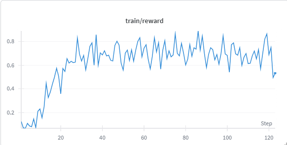
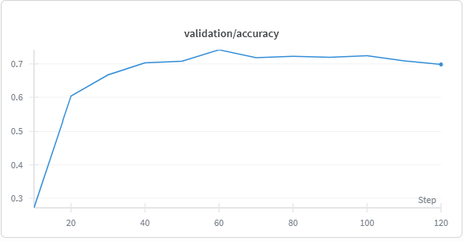

# Solve a Sliding Puzzle Using GRPO

This guide explains how to use Nemo RL to train a model to solve the classic **nxn sliding puzzle** game through multi-turn reinforcement learning. This environment implements a classic **n×n sliding puzzle** where numbered tiles must be arranged in sequential order by sliding them into an empty space.

The sliding puzzle task serves as a simple, yet effective example, to illustrate how multi-turn RL and tool-calling are implemented within Nemo RL. This example provides a minimal setup for understanding the core components of Group Relative Policy Optimization (GRPO) and sequential decision-making.


## Quick Start Guide

### 1. Install and Set Up NeMo RL with Megatron Backend (Optional)

To get started, clone and set up the NeMo RL repository by initializing submodules, installing CUDA dependencies, and configuring the environment with uv. Refer to [Prerequisites](https://github.com/NVIDIA-NeMo/RL/tree/main?tab=readme-ov-file#prerequisites) for detailed instructions on installation.

### 2. Train a Model

Train a model to solve the sliding puzzle using GRPO with the default 2×2 configuration.

```bash
uv run python examples/run_grpo_sliding_puzzle.py 
```

### 3. Customize Puzzle Configuration

By default, this training script uses the configuration in [grpo_sliding_puzzle.yaml](../../examples/configs/grpo_sliding_puzzle.yaml). You can customize parameters with command-line overrides to experiment with different puzzle sizes or levels of difficulty.
```bash
# Train on a 3×3 puzzle with 10 random moves to scramble the board
uv run python examples/run_grpo_sliding_puzzle.py \
    env.sliding_puzzle_game.cfg.game_config.size=3 \
    env.sliding_puzzle_game.cfg.game_config.shuffle_moves=10
```

### 4. Monitor Progress

You can enable logging via Weights & Biases and TensorBoard to monitor training metrics such as rewards, success rate, and loss curves.

```bash
# Enable logging (optional)
uv run examples/run_grpo_sliding_puzzle.py \
    --config examples/configs/grpo_sliding_puzzle.yaml \
    logger.wandb_enabled=true \
    logger.tensorboard_enabled=true
```

## Game Mechanics

### Puzzle Structure

The sliding puzzle consists of:
- **Grid**: An `n×n` grid with numbered tiles and one empty space
- **Tiles**: Numbered from `1` to `n²-1`, placed in random order
- **Empty Space**: Represented by `0`, typically starting at the bottom-right corner
- **Goal State**: Sequential arrangement `1, 2, 3, ..., n²-1` with `0` at bottom-right

### Example Data Sample
```
===== SLIDING PUZZLE =====
Arrange the 3x3 grid by sliding tiles into the empty space.
- The goal is to arrange numbers from 1 to 8 in order
- Use 'up', 'down', 'left', 'right' to slide in that direction
- Use 'view' to see the current state of the board

Current Board State:

  +---------+
1 | 1     3 |
2 | 4  2  5 |
3 | 7  8  6 |
  +---------+
     1  2  3 

Reach the goal state where numbers are ordered 1 through 8 with the empty space (0) at the bottom right.
Valid actions: 'up', 'down', 'left', 'right', or 'slide row col' (e.g., 'slide 1 2').
After thinking, output your chosen action on a new line starting with '<action></action>' like this:
<action>your_action</action>
If you just want to see the board, output <action>view</action>
Think carefully step-by-step before acting.

```

### Movement Rules

1. **Valid Moves**: Only tiles adjacent to the empty space `0` can be moved.
2. **Movement Direction**: Tiles slide into the empty space, not the other way around.
3. **Grid Boundaries**: Moves that would go beyond the grid are invalid.
4. **Single Tile Movement**: Each action affects only one tile at a time.

All actions must be wrapped in XML-style tags and follow one of the formats below:
```xml
<action>up</action>          <!-- Slide a tile up into the empty space -->
<action>slide 2 1</action>   <!-- Slide tile at row 2, column 1 -->
<action>view</action>        <!-- View the current board state -->
```

## Data Generation

### Configuration Parameters

Sliding puzzle instances are generated using the following parameters, which can be customized via the configuration file:

```yaml
env:
  sliding_puzzle_game:
    cfg:
      game_config:
        size: 5              # Size of the puzzle grid (e.g., 3x3, 4x4, 5x5)
        shuffle_moves: 4     # Number of random moves to scramble the puzzle
      max_moves: 40          # Maximum number of moves allowed per episode
```
#### Description

- **`size`**: Determines the dimensions of the puzzle board (`n×n`).
- **`shuffle_moves`**: Controls the initial difficulty by randomly moving tiles to scramble the puzzle.
- **`max_moves`**: Sets an upper limit on the number of actions the agent can take in one episode.

Grids are generated with sizes ranging from 2 to game_config.size. Each grid starts with a solved state and is shuffled by moving random tiles to the empty space n times, where n is a random number between 1 and `shuffle_moves`. The grid is shuffled using only valid moves. 
The `generate_puzzle_datum()` function in [run_grpo_sliding_puzzle.py](../../examples/run_grpo_sliding_puzzle.py) is responsible for generating the dataset. [sliding_puzzle.py](../../nemo_rl/environments/games/sliding_puzzle.py) contains the `SlidingPuzzleGameLogic` class, responsible for puzzle generation and initialization logic. The number of shuffle moves and size of the grid will control puzzle difficulty.

#### Generation Algorithm
The puzzle configuration is randomly generated by sampling the grid size and number of shuffling moves within the defined maximums:

```python
def generate_random_config(max_config: dict[str, Any]) -> dict[str, Any]:
    """Generate a random config for the sliding puzzle game."""
    shuffle_moves = random.randint(1, max_config.get("shuffle_moves"))
    if shuffle_moves % 2 == 0:
        shuffle_moves += 1  # Ensure odd number for proper scrambling
    return {
        "size": random.randint(2, max_config.get("size", 3)),
        "shuffle_moves": shuffle_moves,
    }

      game_config = generate_random_config(game_config)
      initial_game_state = SlidingPuzzleGameLogic.generate(game_config)
      initial_render = SlidingPuzzleGameLogic.render(initial_game_state)
      welcome_message = SlidingPuzzleGameLogic.init(initial_game_state)
  ```

### Dataset Size Calculation

Dataset size is defined by parameters in grpo_sliding_puzzle.yaml:
```
Training Size = num_prompts_per_step × num_generations_per_prompt × max_num_steps
Validation Size = max_val_samples
```

### Data Structure

Each training sample is returned as a `DatumSpec` dictionary with the following structure:

```python
datum: DatumSpec = {
    "message_log": message_log,              # Conversation history
    "length": len(tokenized_prompt),         # Token count
    "extra_env_info": metadata,              # Game state metadata
    "loss_multiplier": 1.0,                  # Training weight
    "idx": idx,                              # Sample index
    "task_name": task_name,                  # Task identifier
    "stop_strings": ["</action>"],           # Termination tokens
}
```

## Environment Interface

<!-- ### Architecture Flow

```
GRPO Training Pipeline:
run_grpo_sliding_puzzle.grpo_train → nemo_rl.experience.rollouts.run_multi_turn_rollouts → generate_response + calculate_reward → environments.games.sliding_puzzle.SlidingPuzzleEnv.step
``` -->

### Core Classes

The [sliding_puzzle.py](../../nemo_rl/environments/games/sliding_puzzle.py) defines the environment and the logic for interacting with the environment. The core classes used are outlined below:

#### SlidingPuzzleEnv
The SlidingPuzzleEnv class serves as the main environment, implementing a Ray remote actor for distributed processing and using functions from both the SlidingPuzzleGameLogic and SlidingPuzzleRunner classes to interact with the environment.

```python
@ray.remote
class SlidingPuzzleEnv(EnvironmentInterface):
    def __init__(self, cfg: Optional[SlidingPuzzleConfig] = None):
        """Initialize environment with configuration."""
        
    def step(
        self,
        message_log_batch: list[LLMMessageLogType],
        metadata_batch: list[SlidingPuzzleMetadata],
    ) -> EnvironmentReturn:
        """Process batch of interactions."""
```

#### SlidingPuzzleGameLogic
The SlidingPuzzleGameLogic class defines the core game mechanics through static methods for puzzle operations and includes functionality for reward calculation.

```python
class SlidingPuzzleGameLogic:
    @staticmethod
    def generate(config: dict[str, Any]) -> dict[str, Any]:
        """Generate new puzzle with specified configuration."""
        
    @staticmethod
    def init(game_state: dict[str, Any]) -> str:
        """Create welcome message with game rules."""
        
    @staticmethod
    def step(action: str, game_state: dict[str, Any]) -> tuple[str, float, bool, dict[str, Any]]:
        """Execute action and return (response, reward, terminated, new_state)."""
        
    @staticmethod
    def render(game_state: dict[str, Any]) -> str:
        """Render current puzzle state as visual grid."""
```

#### SlidingPuzzleRunner

The SlidingPuzzleRunner class handles turn processing and action management.

```python
class SlidingPuzzleRunner:
    def __init__(self):
        """Initialize runner with no persistent state."""
        
    def _parse_action(self, text: str) -> Optional[str]:
        """Extract action from model response using XML tag parsing."""
        
    def process_turn(
        self,
        message_log: LLMMessageLogType,
        metadata: SlidingPuzzleMetadata,
    ) -> tuple[dict[str, str], float, bool, Optional[list[str]], Optional[SlidingPuzzleMetadata]]:
        """Process single turn and return (response_dict, reward, terminated, stop_strings, updated_metadata)."""
```

### Processing Pipeline

The step function creates a processing pipeline where each class handles specific responsibilities:

1. **Parse action** (`SlidingPuzzleRunner`): Extracts the action from the model response using XML tag parsing via the `process_turn` method.
2. **Validate Move** (`SlidingPuzzleGameLogic`): Checks if the action is valid for the current game state and then executes the move.
3. **Execute Action** (`SlidingPuzzleGameLogic`): Applies the move to the game state using the `SlidingPuzzleGameLogic.step` method.
4. **Calculate Reward** (`SlidingPuzzleGameLogic`): Assigns a reward based on progress toward solving the puzzle (step function).
5. **Return Results** (`SlidingPuzzleEnv`):  Returns the updated interaction state as an `EnvironmentReturn` object.

## Reward System

### Reward Structure

The environment uses a sparse reward scheme designed to encourage complete solution strategies, rather than incremental progress or reward hacking.

| Condition | Reward | Termination |
|-----------|--------|-------------|
| Valid move (non-solving) | 0.0 | False |
| Invalid move | 0.0 | False |
| Puzzle solved | 1.0 | True |
| Max moves reached | 0.0 | True |
| Invalid action format | 0.0 | False |

>Goal: The agent receives a reward only upon successfully solving the puzzle, promoting long-horizon planning.

### Reward Calculation Logic

```python
def step(action: str, game_state: dict[str, Any]) -> tuple[str, float, bool, dict[str, Any]]:
    """Process action and calculate reward."""
    reward = 0.0
    is_terminated = False
    
    if move_made:
        # Check if puzzle is solved
        if new_state["grid"] == new_state["solution"]:
            reward = 1.0
            is_terminated = True
        else:
            reward = 0.0  # No reward for non-solving moves
    
    return response, reward, is_terminated, new_state
```
## Results

We fine-tuned [`Qwen/Qwen2.5-1.5B-Instruct`](https://huggingface.co/Qwen/Qwen2.5-1.5B-Instruct) on synthetic data for 120 steps using the following configuration settings:

```
game_config:
    size: 5 # Size of the puzzle (e.g., 2 for 2x2, 3 for 3x3)
    shuffle_moves: 10 # Number of random moves to shuffle the solved state
max_moves: 30
```

The figure below displays training rewards vs. steps, along with validation accuracy.





